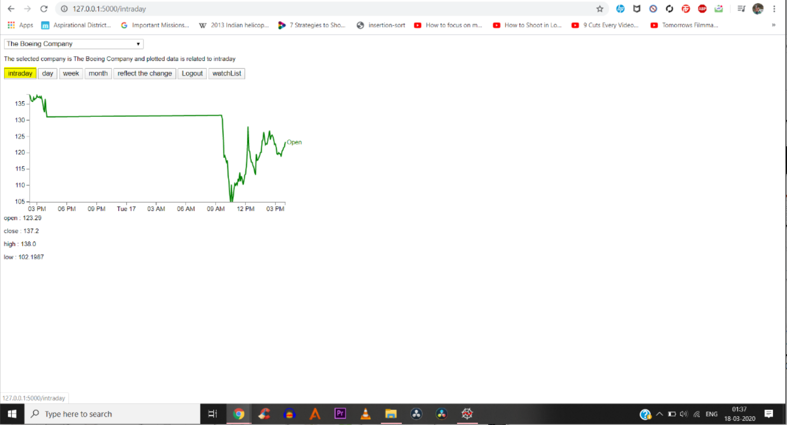

# Altview-Dashboard

CONTSRAINTS :
1. I have used HTML,CSS for front end.
2. d3.js for data visualisation.
3. Flask,a python framework for backend.

(0)This is the code done in python on spyder platform,once we click on run button then an url will be generated and have to run that url in order to run the code.

(1)This is the first page we will get as soon as we rn the code in spyder and paste the url in our browser.
We will get a Signup and login page here,if we dont have a account previously then we need to click on signup button and signup or if we have a account previously then we can click on login button and login into our account.

(2)This is the signup page.As soon as we fill the details and press signup button then the details will be saved in a csv file,so whenever if the user enters details and press login it checks the with the entries in csv file,if the entries typed by the user matches with the entires in csv file then it logins.

(3)If we try to login with wrong details i.e if the entries/details typed by the user misses in the csv file,then it redirects to wrong credentials page.

(4)This is the Login page,the details we type checks in the csv file if they are present or not.

(5)As soon as we login,then it directly directs to the Intraday data visualisation page of the Boeing Company.We are using d3.js to visualise the data.Here I plotted the graph between time series in a day vs the stock price by taking all the open values of a company in a time series in x-axis to stock price in Y-axis.And also we are showing the open , close ,high , low values of stock of a selected company from the drop down list.

(6)Then as we press Day button then it shows Day data visualisation of the company we select.

(7)As we press Week button then it shows Week Data Visualisation of the company we select.

(8)This is the Month data visualisation of boeing company.

(9)If we want to change the company then we have to change the company name in the drop down box provided and then have to press on the REFLECT THE CHANGE  button inorder to see other company's stock data.It automatically directs to the Intraday page of the selected comany.

(10)Then another required feature is Watchlist.To view user watchlist then press on the watchlist button provided ,after pressing it redirects to watchlist page where we can see different companies user adds into watchlist.

(11)Then we should select the company name from the drop down list provided which we wanted to add to the watchlist and press on Add to list button and press REFRESH FOR CHANGES button to reflect the change.

(12)We can add multiple companies to user watchlist.

(13)To remove any company from user watchlist then select the company from the second drop down list provided which to be removed then press REMOVE FROM LIST  button provided to remove from the watchlist of the user and press REFRESH FOR CHANGES button to reflect the changes.

(14)Press HOME button to redirect to Home page.

(15)To Logout from the account,then press Logout button provided in Home page.

